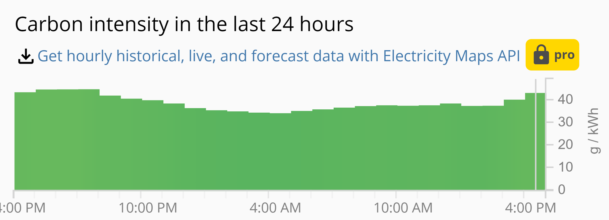

# Time-shift Kubernetes cron jobs

## Description
The carbon emissions of a software system depends on the power consumed by that software, but also on the Carbon intensity of the electricity it is powered on. For this reason, running energy-efficient software on carbon intensive electricity grid, might be inefficient to reduce its global carbon emissions. 

Carbon aware time scheduling, is about scheduling workloads to execute, when electricity carbon intensity is low.

## Solution
Kubernetes recurrent Jobs (such as ML Training Jobs, Batchs, etc.) are implemented [as CronJobs](https://kubernetes.io/docs/concepts/workloads/controllers/cron-jobs/).  They can be time shifted by using **carbon intensity Forecast data** (24h usually, depdening on the Electricity data provider),  to calculate the best time in the future to execute the job.

To capture the impact of time shifting, the following image shows variation of electricity carbon intensity during a day, from one the electricity data providers, [ElectricityMap](https://app.electricitymaps.com/map).

## SCI Impact
`SCI = (E * I) + M per R`
[Software Carbon Intensity Spec](https://grnsft.org/sci)

Regarding the SCI equation, Time shifting will impact:

- `I`: The goal is to reduce SCI by reducing carbon intensity.

## Assumptions
In order to estimate the best time to schedule the CronJob:
- The execution duration of the Job is assumed to be known.
- The Job should ideally have a flexible deadline which allows a wider time window for scheduling.

## Considerations
- This pattern does not require an application code change and can be handled at the platform operating level.
- When cron jobs have scheduling constraints or dependencies, it can be difficult to change their timing.

